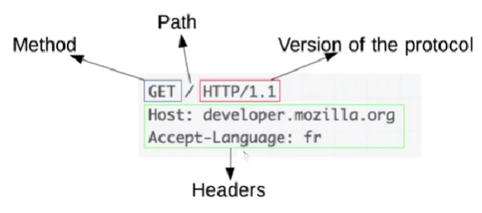

# Arquitetura Cliente Servidor 

## Exemplo de Requisição

## Cliente
    Geralmente é um navegador web que envia requisições a um servidor

## Servdor
    Geralmente uma maquina acessivel pela internet que recebe a requisição, a processa e envia de volta uma resposta para o cliente.

# Caracteristicas do HTTP

## Simples
    Facil de entender e ultilizar 

## Extensivel
    Permite adicionar novas funcionalidade facilmente

## Stateless
    Ou sem estado (mas com sessão)

# Estrutura das mensagens 

## Requisição

### Método 
    O tipo de operação a ser realizada (GET, POST, OPTIONS, HEAD, etc)

### Caminho
    O caminho do recurso a ser obtido, basicamente a URL do recurso sem a parte inicial (potocolo, domino e porta)

### Versão
    O protocolo HTTP possui diferentes versões, com suas respectivas particularidades, logo é preciso definir a versão que se está utilizando

### Cabeçalho
    Informações adicionais entre cliente e servidor

### Corpo
    Conteudo da mensagens, usada por exemplo, ao enviar dados via POST. 

## Respostas

### Código e mensagen de status
    Umcódigo e uma breve descrição que indeicam se a requisição foi bem sucessida ou não (e o motivo)

    Exemplo:
    200, sucesso
    301, rediricionamento (movido permanentemente)
    404, não encontrado
    500, erro interno do servidor

### Versão 
    Versão do protocolo como nas requisições

### Cabeçalho
    Informações adcionais entre cliente e servidor, como nas requisições

### Corpo
    Opcionamente pode assumir um corpo, que é o conteudo da mensagem (como uma pagina HTML ou um documento JSON)

# Exemplos
    Quando digitamos um endereço de um site no navegador estamos enviandi uma requisição que receberar a resposta com um documento HTML

    Quando solicitamos informações a uma API Restfull enviamos uma requisição que receberá uma resposta contendo um documento JSON